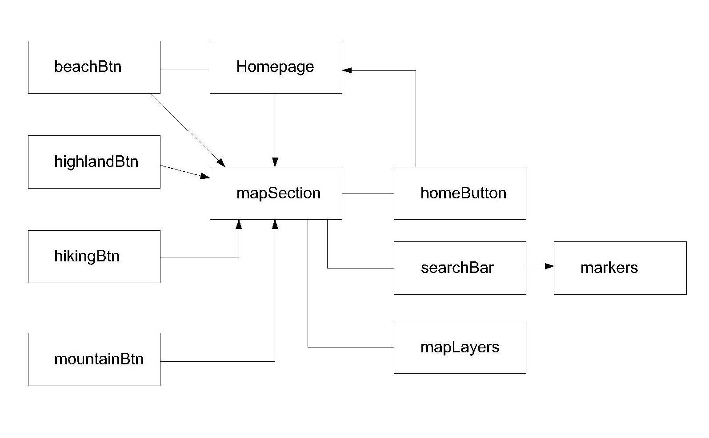

# MAP-DAVAO-LIFE-IS-HERE

 

## Project Summary

### Context

Davao Life-Is-Here is a mobile or web application which will help the users to locate the tourist spots of the city such as beaches, highlands, hiking sites and mountain. This website will showcase of what the City has to offer - the pride of Davao - known for nice beaches and picturesque view highlands.

### Target Audience & Characteristics

1. Both foreign and local traveller from different places interested in exploring the tourist attractions of the City.
2. People who likes to distress, unwind, which will help their mental health at ease.
3. People who are open for adventure, into nature and physical activities such as hiking, climbing, etc.
4. Anyone who is enthusiastic in discovering new places and embracing the city's culture.

### User/Organization's Goals

The objective of this application is to showcase the wonderful and beautiful ambiance of highland's nature, beach places, hiking sites of Davao.

### Justification of Project's Existence

With increasing number of tourists going in & out in the City of Davao, which is located in the biggest island of Philippines - Mindanao, where finding places to relax and unwind is quite difficult which may cause inconvenience to the travellers. With the use of this app, it will help the users to easily locate the particular spots without any hassle and stress. 

### Live Demo
Click [here](https://allanpaul0728.github.io/MAP-DVO-LIFEISHERE/) to proceed for live demo.

## UI/UX

### User Stories & Acceptance Criteria

User Stories | Acceptance Criteria
------------ | ------------
As a local traveller who is living from another city of the same country and wants to explore beach resorts in Davao, given that I am a first-time visitor in an unfamiliar place such as Davao. | Location services aims to identify the recommended beach resorts in the City.
As a foreign tourist who likes to engage in some crazy adventure in southern part of Mindanao such as Davao. | The application will suggests and show particular locations for hiking area, highlands and davao mountains with helpful information about the place. 

### Wireframe

Click [here](wireframes/DVO-MAP-WIREFRAME.pdf) to check the PC/Laptop and Mobile draft design of the application.

### 5 Planes of UI/UX

#### Strategy

* For users who want a hassle-free travel and easy access for locating destinations.
* Pain points: With a City like Davao that is not quite famous as the other cities where their tourist spots has been endorsed and known for years, users must be provided such application that will guide them navigating/locating the tourist attractions of Davao City

#### Structure

 

#### Surface

## Features

Functional Requirements:
* Search for Davao Beach Resorts
* Search for Highland Resorts
* Search for Hiking Sites/Area
* Search for Davao Mountains
* Location marked display of Institutions/Establishments such hotels, schools, restaurants/shops, fitness gyms in the City

Content:
* Information of the place
* Image of the specific destination
* Address or location

Non-functional:
* Maplayers - Streets, Satellite, Navigation-type
* Mobile responsiveness

## Technology Used

* Visual Studio Code / Gitpod
    - Used platform for creating web application

* HTML
    - Used to create the web application body structure

* CSS
    - Used to design, beautify or style the web app

* JavaScript
    - Used to execute the functions of HTML elements

* [GitHub](https://github.com/)
    - Platform for the web project and used for the deployment of the application

* [Leaflet](https://leafletjs.com/examples/quick-start/)
    - Used to apply the map on the web project

* [Leaflet Marking Cluster](https://github.com/Leaflet/Leaflet.markercluster)
    - Used for marking clustering for leaflet

* [Bootstrap v5.1](https://getbootstrap.com/docs/5.1/getting-started/introduction/)
    - Used for additional styling, templates to apply in HTML for the web project

* [Axios](https://cdnjs.com/libraries/axios)
    - HTTP Client for the browser

* [Fontawesome](https://fontawesome.com/search)
    - Used to apply icons for the web project

* [Google Fonts](https://fonts.google.com/)
    - Used to apply font style  for the web project

* [Figma](https://www.figma.com/)
    - Used to create wireframes of the web application

* [Mapbox](https://www.mapbox.com/)
    - Used to implement map layers 

## Testing

## Deployment

* [GitHub](https://github.com/) - as hosting platform of the web application

* Deployment Procedure:
    - On GitHub, go to your repositories, click your current made web project. Second, click on Settings under repository project's name. Third, on the left side, you can see the "Code and Automation" section, click the "Pages". Then, on "GitHub Pages", seclect the publishing source - select "main". Lastly, Click "Save".

## Live Link

* Please click [here](https://allanpaul0728.github.io/MAP-DVO-LIFEISHERE/) for the live link

## Credits & Acknowledgement

* [Department of Tourism](http://www.experiencephilippines.org/tourism/destinations-tourism/davao-department-of-tourism/) & [Davao City Governemnt's Website](https://www.davaocity.gov.ph/) 
    - As reference and source for the data in creating own JSON files.

* [Google](https://www.google.com/)
    - Another source on creating customized JSON data for its coordinates - latitude and longitude of the location. As well as the description and photo of the place were gathered with the help of this website

* All applications/softwares mentioned on "Technologies Used" section and also its developers or creator of these wonderful applications.
    - For making the life of aspiring web developers and designers easier

* All TAs during consultation day - To Mr. Ace, Ms. Razia, Mr. Arif and Mr. Shun